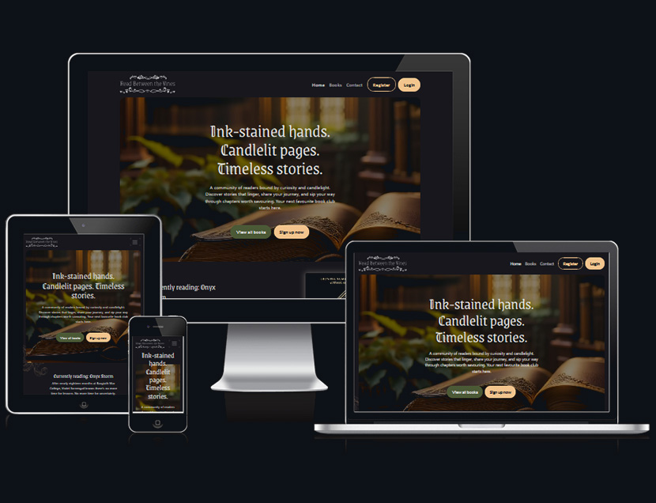

# Read Between the Vines



## A book club site with a fantasy genre focus that encourages group reading

[View the website on Heroku](https://read-between-the-vines-24a3e4f3dbe6.herokuapp.com/).

## Table of Contents

1. [Overview](#overview)
2. [User Experience (UX)](#user-experience-ux)
   1. [Strategy](#strategy)
   2. [Scope](#scope)
   3. [Structure](#structure)
   4. [Skeleton](#skeleton)
   5. [Surface](#surface)
3. [Features](#features)
   1. [Existing Features](#existing-features)
   2. [Future Feature Considerations](#future-feature-considerations)
4. [Technologies Used](#technologies-used)
5. [Testing](#testing)
6. [Deployment](#deployment)
   1. [Heroku](#heroku)
   2. [Forking the GitHub Repository](#forking-the-github-repository)
   3. [Making a Local Clone](#making-a-local-clone)
7. [Credits](#credits)
   1. [Code](#code)
   2. [Content](#content)
   3. [Media](#media)
   4. [Acknowledgements](#acknowledgements)
   5. [Disclaimer](#disclaimer)

## Overview

### User Experience (UX)

#### Strategy

##### User stories

###### First-time Visitor Goals

1. As a first-time visitor, I want to be able to easily determine and understand
   the main purpose of the website.
2. As a first-time visitor, I want to be able to see what is currently being
   read by the book club.
3. As a first-time visitor, I want to be able to create an account and sign
   up to the site/club.
4. As a first-time visitor, I want to be able to view the reading progress
   of the books.

###### Returning Visitor Goals

1. As a returning visitor, I want to be able to see what books are on the reading
   list, so I have an idea of the next books to read.
2. As a returning visitor, I want to be able to view all books that have been finished.
3. As a returning visitor, I want to be able to log back in to the site.
4. As a returning visitor, I want to be able to add/update my reading progress to
   compare it to the average of the club.

###### Frequent User Goals

1. As a frequent user, I want to be able to comment on books to join the conversation.
2. As a frequent user, I also want to be able to edit any comments I have made.
3. As a frequent user, I want to create/read/add/update my reading progress,
   so I can keep track and compare it to the rest of the club.
4. As a frequent user, I want to be able to be able to submit a contact form,
   in order to leave feadback or future book suggestions for the club.

#### Scope

##### Requirements

###### User Interface (UI) Design

-
-
-

###### Responsiveness and Cross-Platform Support

-
-

###### Performance Metrics and Insights

-
-

#### Structure

##### Homepage

##### 404 Page

#### Skeleton

##### Wireframes

[View](assets/wireframes/read-between-the-vines-wireframes.pdf):
due to the size of this file, it is recommended to download the PDF file
for a better viewing experience. This can be done by right-clicking the link
above, followed by selecting 'Save Link As...'.

#### Surface

##### Design

###### Colour Scheme

The colour palette use for this project was generated by [Adobe Color](https://color.adobe.com/).
Using an AI generated asset from Adobe Stock, a colour palette was generated by
uploading it to the 'Extract Theme' section, with the following colours being used:

- Charcoal: #18171D (Primary colour, used as the main background colour)
- Off-white: #DFDFDF (Secondary colour, used for text and button hover states)
- Forest Green: #4B5936 (Used as an alternative background section colour,
  and for secondary buttons)
- Brown: #732F18 (Used for category labels on beige backgrounds)
- Beige: #F2C48D (Used for alternative section backgrounds,
  and for primary buttons/link colours)

#### Typography

- [Grenze Gotisch](https://fonts.google.com/specimen/Grenze+Gotisch):
  A blackletter font used for headings, to help convey the dark academic theme used.
- [Lato](https://fonts.google.com/specimen/Lato):
  A humanist sans-serif font that is legible and easy to read, and pairs well
  with the heading font selected with having similar x-heights.

#### Imagery

- The home hero video was generated using [Adobe Firefly](https://www.adobe.com/products/firefly/features/ai-video-generator.html)
- The other hero images used throughout the site were downloaded from [Adobe Stock](https://www.google.com/url?sa=t&source=web&rct=j&opi=89978449&url=https://stock.adobe.com/uk/&ved=2ahUKEwi0rJ_A4YWOAxVMTkEAHXq-ARAQFnoECD4QAQ&usg=AOvVaw0yn-QK1OZQiC9yFD0Q-ctq),
  and are AI generated.
- The image used in the footer call-to-action section was also
  downloaded from [Adobe Stock](https://www.google.com/url?sa=t&source=web&rct=j&opi=89978450&url=https://stock.adobe.com/uk/&ved=2ahUKEwi0rJ_A4YWOAxVMTkEAHXq-ARAQFnoECD4QAQ&usg=AOvVaw0yn-QK1OZQiC9yFD0Q-ctq)
- All book covers were sources from their respective pages
  on [Amazon](https://www.amazon.co.uk/)
- Decorative background elements (filigree) were downloaded from [Adobe Stock](https://www.google.com/url?sa=t&source=web&rct=j&opi=89978449&url=https://stock.adobe.com/uk/&ved=2ahUKEwi0rJ_A4YWOAxVMTkEAHXq-ARAQFnoECD4QAQ&usg=AOvVaw0yn-QK1OZQiC9yFD0Q-ctq)
- Decorative elements for the logo were also downloaded from [Adobe Stock](https://www.google.com/url?sa=t&source=web&rct=j&opi=89978449&url=https://stock.adobe.com/uk/&ved=2ahUKEwi0rJ_A4YWOAxVMTkEAHXq-ARAQFnoECD4QAQ&usg=AOvVaw0yn-QK1OZQiC9yFD0Q-ctq)

#### High-fidelity Designs

[View](assets/wireframes/read-between-the-vines-designs.pdf):
due to the size of this file, it is recommended to download the PDF file
for a better viewing experience. This can be done by right-clicking the link
above, followed by selecting 'Save Link As...'.

Only the homepage was designed to create the visual styles that were used
throughout the rest of the site.

#### Features

##### Existing Features

###### Dynamic Page Loading

##### Future Feature Considerations

###### Additional Characters

#### Technologies Used

##### Languages Used

- [HTML5](https://en.wikipedia.org/wiki/HTML5)
- [CSS3](https://en.wikipedia.org/wiki/Cascading_Style_Sheets)
- [JavaScript ES6](https://en.wikipedia.org/wiki/ECMAScript)
- [Python](https://www.python.org/)

##### Frameworks, Libraries & Programs Used

- [Bootstrap 5](https://getbootstrap.com/)
- [Google Fonts](https://fonts.google.com/)
- Google fonts was used to embed the "Grenze Gotisch" and "Lato" fonts so they could
  be used throughout the site.
- [Font Awesome](https://fontawesome.com/)
- Font Awesome was used for the arrows and social icons on the site.
- [Git](https://git-scm.com/)
- Git was used for version control to commit to Git and push to GitHub.
- [GitHub](https://github.com/)
- GitHub was used to store the project files after being committed to Git.
- [ui.dev/amiresponsive](https://ui.dev/amiresponsive)
- ui.dev/amiresponsive was used to create the website device mock-up image
  used at the top of this file.
- [Figma](https://www.figma.com/)
- Figma was used to create the [wireframes](assets/wireframes/read-between-the-vines-wireframes.pdf)
  and [designs](assets/wireframes/read-between-the-vines-designs.pdf)
  for the project, as well as the logo and favicon. The wireframes were created
  using the [BRIX Templates Website Wireframes UI Kit](https://www.figma.com/community/file/1200835310657744518)
- [favicon.io](https://favicon.io)
- favicon.io was used to generate the various favicon sizes used throughout the project.
- [Photoshop](https://www.adobe.com/uk/products/photoshop.html)
- Photoshop was used to edit, resize, and export the images in WebP format
  throughout the website.
- [Illustrator](https://www.adobe.com/uk/products/illustrator.html)
- Illustrator was used to open and import Adobe Stock illustration assets.
- [HTML Validator](https://www.htmlvalidator.com)
- The HTML Validator was used to validate HTML and CSS.
- [Google PageSpeed Insights](https://pagespeed.web.dev/)
- Google PageSpeed Insights was used to check the websites performance
  across mobile and desktop devices.
- [WAVE Web Accessibility Evaluation Tool](https://wave.webaim.org/)
- WAVE was used to test the websites accessibility features.

#### Testing

Testing documentation and process can be found under [TESTING.md](https://github.com/jordancrouch/read-between-the-vines/blob/main/TESTING.md)

#### Deployment

##### Heroku

The project was deployed to Heroku using the following steps...

1.

##### Forking the GitHub Repository

By forking the GitHub Repository, we make a copy of the original repository on
our GitHub account to view and/or make changes without affecting the original
repository by using the following steps...

1. Log in to GitHub and locate the [jordancrouch/read-between-the-vines](https://github.com/jordancrouch/read-between-the-vines/)
   repository.
2. At the top of the Repository (not top of page) just above the "Settings"
   Button on the menu, locate the "Fork" Button.
3. You should now have a copy of the original repository in your GitHub account.

### Making a Local Clone

1. Log in to GitHub and locate the
   [jordancrouch/read-between-the-vines](https://github.com/jordancrouch/read-between-the-vines/)
   repository.
2. Under the repository name, click "Code".
3. To clone the repository using HTTPS, under "Code", click on the "HTTPS" tab
   and copy the link.
4. Open Git Bash
5. Change the current working directory to the location where you want the
   cloned directory to be made.
6. Type `git clone`, and then paste the URL you copied in Step 3.

   ```sh
   git clone https://github.com/jordancrouch/read-between-the-vines.git
   ```

7. Press Enter. Your local clone will be created.

   ```sh
   TODO: Paste clone output
   ```

[Retrieve pictures](https://help.github.com/en/github/creating-cloning-and-archiving-repositories/cloning-a-repository#cloning-a-repository-to-github-desktop)
for some of the buttons and more detailed explanations of the above process.

#### Credits

##### Code

-

##### Content

- Text content in hero banners, section titles, and call to actions were
  generated by [ChatGPT](https://chatgpt.com/).
- Book-related content was sourced from respective pages on [Amazon](https://www.amazon.co.uk/).

##### Media

- The home hero video was generated using [Adobe Firefly](https://www.adobe.com/products/firefly/features/ai-video-generator.html)
- The other hero images used throughout the site were downloaded from [Adobe Stock](https://www.google.com/url?sa=t&source=web&rct=j&opi=89978449&url=https://stock.adobe.com/uk/&ved=2ahUKEwi0rJ_A4YWOAxVMTkEAHXq-ARAQFnoECD4QAQ&usg=AOvVaw0yn-QK1OZQiC9yFD0Q-ctq),
  and are AI generated.
- The image used in the footer call-to-action section was also
  downloaded from [Adobe Stock](https://www.google.com/url?sa=t&source=web&rct=j&opi=89978451&url=https://stock.adobe.com/uk/&ved=2ahUKEwi0rJ_A4YWOAxVMTkEAHXq-ARAQFnoECD4QAQ&usg=AOvVaw0yn-QK1OZQiC9yFD0Q-ctq)
- All book covers were sources from their respective pages
  on [Amazon](https://www.amazon.co.uk/)
- Decorative background elements (filigree) were downloaded from [Adobe Stock](https://www.google.com/url?sa=t&source=web&rct=j&opi=89978449&url=https://stock.adobe.com/uk/&ved=2ahUKEwi0rJ_A4YWOAxVMTkEAHXq-ARAQFnoECD4QAQ&usg=AOvVaw0yn-QK1OZQiC9yFD0Q-ctq)
- Decorative elements for the logo were also downloaded from [Adobe Stock](https://www.google.com/url?sa=t&source=web&rct=j&opi=89978449&url=https://stock.adobe.com/uk/&ved=2ahUKEwi0rJ_A4YWOAxVMTkEAHXq-ARAQFnoECD4QAQ&usg=AOvVaw0yn-QK1OZQiC9yFD0Q-ctq)
- The logo was created in [Figma](https://www.figma.com) using the Adobe Stock
  assets mentioned above.
- The favicon was also created in [Figma](https://www.figma.com) using the Adobe
  Stock assets mentioned above and converted using [favicon.io](https://favicon.io/)

##### Acknowledgements

- Thank you to our Cohort Facilitator, Lewis Dillon, for our weekly standups.
- Thank you to my mentor, Ben Kavanagh, for your continued help and support.

##### Disclaimer

This website is for educational purposes only.
